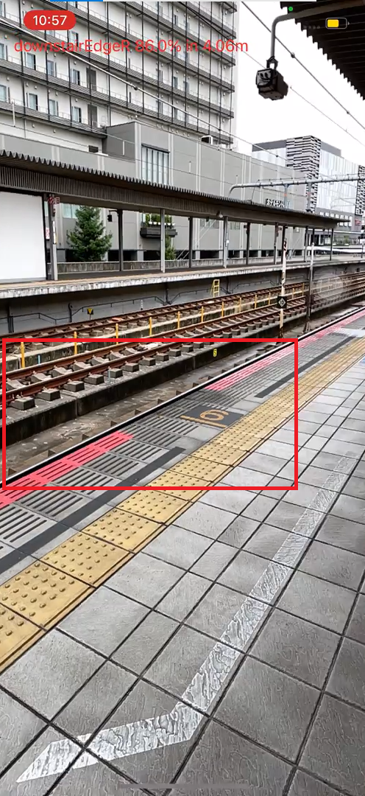

# LiDAR plus object detection:
LiDAR distance estimation and object detection using iOS and YOLOv3tiny

## What is it:
Applying iOS LiDAR hardware to estimate the distance of object detected by custom-trained object detector (YOLOv3tiny in this case).

## Availability: 
This application only works on iPhone with LiDAR scanner hardware.

## Environment tested: 
iPhone 12 Pro/ iOS 15.4.1/ Xcode version 13.2.1/ macOS Big Sur 11.6.5

## Demonstration:


*Notice that the app was set at a frame rate 3fps to save resources (battery, CPU, etc), so it might look "lag" while running.

## Model training and dataset:

The raw dataset contains 4236 images that were mostly collected from train stations in the Kobe and Osaka regions in Japan. Object detector model training using TensorFlow/Keras backend approach. Data augmentation methods of crop (0% Minimum Zoom, 20% Maximum Zoom), saturation (Between -25% and +25%), and brightness (Between -30% and +30%) were applied, and the final dataset consists of 10,674 images with 6,366 labelled platform edges. The following table shows the class label with the number of labelled objects:

Custom-trained object detector:

```
DangerZones20220323.mlmodel
```

Class label | No. of labelled objects in custom-trained model 
:---: | :---:
downstairC | 599
downstairL | 2155
downstairR | 2246
trainSameSide | 3352
trainOtherSide | 2864
platformEdgeC | 155
platformEdgeL | 3241
platformEdgeR | 2970
platformDoor | 1309
Total | 18891

## Disclaimers/notice:
This code was primarily a prototypic demonstration application of the Master's Thesis "Railway platform edge detection method for visually-impaired using computer vision fused with depth maps from LiDAR" (Class of 2022) at Graduate School of Information Technology, Kobe Institute of Computing.

## References/Acknowledgement:

[1]R, Okuda, AR Sample. <https://github.com/ryokuda/ARSample>.

[2]R, Okuda, "The pedestrian signal identification device," Japan Patent 6737968, Feb,07,2020. 
(奧田亮輔. 歩行者信号識別装置. 特許第6737968号. 2020-02-07.)
